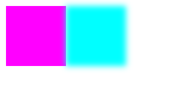

**When this feature ships, the content below will live on MDN under
[developer.mozilla.org/en-US/docs/Web/CanvasRenderingContext2D/CanvasFilter](https://developer.mozilla.org/en-US/docs/Web/CanvasRenderingContext2D/CanvasFilter).**

## Description

`CanvasFilter` provides an interface for creating [SVG filters](https://developer.mozilla.org/en-US/docs/Web/SVG/Element/filter) for `CanvasRenderingContext2D` using JavaScript. A subset of filters are availble via this feature: [`feConvolveMatrix`](https://developer.mozilla.org/en-US/docs/Web/SVG/Element/feConvolveMatrix), [`feComponentTransfer`](https://developer.mozilla.org/en-US/docs/Web/SVG/Element/feComponentTransfer), [`feGaussianBlur`](https://developer.mozilla.org/en-US/docs/Web/SVG/Element/feGaussianBlur), and [`feColorMatrix`](https://developer.mozilla.org/en-US/docs/Web/SVG/Element/feColorMatrix).

## Syntax

`CanvasFilter`s are passed into the `CanvasRenderingContext2D.filter` attribute. The `new CanvasFilter` constructor can take in either a single object, representing one filter stage:

```js
CanvasRenderingContext2D.filter = new CanvasFilter({filter: FILTER_NAME, FILTER_ATTRIBUTES});
```
or an array representing multiple filter stages, which will be applied in sequence:

```js
CanvasRenderingContext2D.filter = new CanvasFilter([
 {filter: STAGE_ONE_FILTER_NAME, STAGE_ONE_FILTER_ATTRIBUTES},
 {filter: STAGE_TWO_FILTER_NAME, STAGE_TWO_FILTER_ATTRIBUTES},
]);
```

Filter attributes are key/value pairs corresponding to [attributes in their SVG versions](https://drafts.fxtf.org/filter-effects/).

## Example

This creates a `CanvasFilter` that swaps the red and green channels, then blurs the image by 5 pixels:

```js
ctx.filter = "none";
ctx.fillStyle = "magenta";
 // Draw a magenta rectangle.
ctx.fillRect(10, 10, 100, 100);

ctx.filter = new CanvasFilter([
 {
  // This filter stage swaps the red and green channels.
  filter: "colorMatrix",
  type: "matrix",
  values: [
    0, 1, 0, 0, 0,
    1, 0, 0, 0, 0,
    0, 0, 1, 0, 0,
    0, 0, 0, 1, 0
  ],
 },
 {
  // The second filter stage is a 5 pixel blur.
  filter: "gaussianBlur",
  stdDeviation: 5,
 }
]);
// The  second rectangle will be cyan and blurred.
ctx.fillRect(110, 10, 100, 100);
```

This results in the following canvas:


