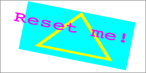

**When this feature ships, the content below will live on MDN under
[developer.mozilla.org/en-US/docs/Web/CanvasRenderingContext2D/reset](https://developer.mozilla.org/en-US/docs/Web/CanvasRenderingContext2D/reset).**

## Description

The `reset()` method of the `CanvasRenderingContext2D` interface
resets the rendering context to its default state. This includes setting the backing buffer to transparent black, clearing the saved state stack, clearing the default path and resetting the drawing state to its initial values.

Drawing state consists of:
 - The current transformation matrix.
 - The current clipping region.
 - The current values of the following attributes: 
    - `strokeStyle`
    - `fillStyle`
    - `globalAlpha`
    - `lineWidth`
    - `lineCap`
    - `lineJoin`
    - `miterLimit`
    - `lineDashOffset`
    - `shadowOffsetX`
    - `shadowOffsetY`
    - `shadowBlur`
    - `shadowColor`
    - `filter`
    - `globalCompositeOperation`
    - `font`
    - `textAlign`
    - `textBaseline`
    - `direction`
    - `textLetterSpacing`
    - `textWordSpacing`
    - `fontKerning`
    - `fontStretch`
    - `fontVariantCaps`
    - `textRendering`
    - `imageSmoothingEnabled`
    - `imageSmoothingQuality`
 - The current dash list.

## Syntax

`CanvasRenderingContext2D.reset();`

## Example

```js
const defaultFillStyle = ctx.fillStyle; // "#000000"
const defaultStrokeStyle = ctx.strokeStyle; // "#000000"
const defaultFont = ctx.font; // "10px sans-serif"
const defaultLineWidth = ctx.lineWidth; // 1

ctx.strokeRect(0, 0, 300, 150); // Outline everything.
ctx.fillStyle = "cyan";
ctx.strokeStyle = "yellow";
ctx.font = "30px monospace";
ctx.lineWidth = 5;

ctx.translate(20, 0);
ctx.rotate(Math.PI/16);
ctx.scale(1.5, 1);
ctx.save();

ctx.fillRect(25, -5, 150, 100);
ctx.beginPath();
ctx.moveTo(100, 0);
ctx.lineTo(150, 80);
ctx.lineTo(50, 80);
ctx.closePath();
ctx.stroke();

ctx.fillStyle = "magenta";
ctx.fillText("Reset me!", 10, 40);
```

This results in the following canvas:



If we then follow up with:
```js
ctx.reset(); // All the above work is undone, canvas is now transparent black

ctx.getTransform().isIdentity; // true
ctx.restore(); // Does nothing, state stack has been cleared
ctx.getTransform().isIdentity; // true

ctx.fillStyle == defaultFillStyle; // true
ctx.strokeStyle == defaultStrokeStyle; // true
ctx.font == defaultFont; // true
ctx.lineWidth == defaultLineWidth; // true

ctx.stroke(); // Does not redraw the triangle, the path has been cleared.

ctx.strokeRect(0, 0, 300, 150); // Outline everything.
ctx.fillText("I have been reset.", 10, 40); // Uses the default font.
```

This will then give us the canvas:


