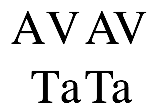

**When this feature ships, the content below will live on MDN under
[developer.mozilla.org/en-US/docs/Web/CanvasRenderingContext2D/fontKerning](https://developer.mozilla.org/en-US/docs/Web/CanvasRenderingContext2D/fontKerning).**

## Description

The `fontKerning` property of the `CanvasRenderingContext2D` interface allows 
the developers to set whether to use of the kerning information stored in a 
font. Kerning defines how letters are spaced. In well-kerned fonts, this 
feature makes character spacing more uniform and pleasant to read than it
would otherwise be. 

It's illustrated in the image below. The left image turns the kerning off and 
the right image turns the kerning on. The default value is `"auto"`.



## Syntax

`CanvasRenderingContext2D.fontKerning = "auto" || "normal" || "none"`
`var fontKerning = CanvasRenderingContext2D.fontKerning`

### Value

A `string` representing the current `fontKerning` value. Possible value are:

#### Options
`"auto"`
The browser determines whether font kerning should be used or not. For example, 
some browsers will disable kerning on small fonts, since applying it could harm the 
readability of text.

`"normal"`
Font kerning information stored in the font must be applied.

`"none"`
Font kerning information stored in the font is disabled.

## Example

This example demonstrates the various `TextLetterSpacing` property values.

```js
const canvas = document.createElement('canvas');
canvas.width = 1000;
canvas.height = 500;
const ctx = canvas.getContext('2d');
document.body.appendChild(canvas);
ctx.font = '20px serif';
ctx.fontKerning = "auto";
ctx.fillText('auto: VAVATATA WAWA', 20, 50);
ctx.fontKerning = "normal";
ctx.fillText('normal: VAVATATA WAWA', 20, 100);
ctx.fontKerning = "none";
ctx.fillText('none: VAVATATA WAWA', 20, 150);
```

## See also
[CSS property font-kerning](https://developer.mozilla.org/en-US/docs/Web/CSS/font-kerning)

